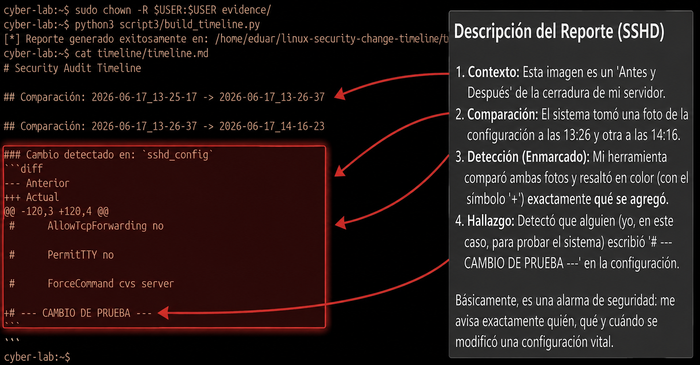

# Linux Security Change Timeline

Este proyecto es una herramienta de auditoría forense diseñada para reconstruir la historia de seguridad de un sistema Linux. En lugar de realizar escaneos en tiempo real, el sistema genera una línea de tiempo (timeline) basada en la captura y análisis de snapshots de configuración, permitiendo identificar cuándo, cómo y qué cambios alteraron la postura de seguridad del servidor.

## Contexto y Motivación
Muchas brechas de seguridad no ocurren por exploits de día cero o ataques sofisticados, sino por la "deriva de configuración" (Configuration Drift): cambios silenciosos realizados por administradores o procesos automatizados que pasan desapercibidos hasta que es demasiado tarde.

Este proyecto ataca el problema desde la **trazabilidad**:
- ¿Cuándo se habilitó el acceso SSH para root?
- ¿Qué usuario con privilegios fue añadido y cuándo?
- ¿En qué momento se desactivó el firewall?

## Arquitectura del Proyecto

El proyecto sigue una metodología de **captura y análisis**:

1. **Capa de Evidencia (`evidence/`):** Almacena snapshots incrementales de archivos de configuración y estados del sistema.
2. **Capa de Recolección (`scripts/collect_evidence.py`):** Agente que extrae el estado actual del sistema y lo persiste.
3. **Capa de Análisis (`scripts/build_timeline.py`):** Motor que procesa la evidencia, detecta diferencias (diffs) y genera una línea de tiempo cronológica.
4. **Capa de Reporte (`timeline/`):** Genera un informe Markdown auditable.

## Evidencia Visual
A continuación se muestra una captura de pantalla que demuestra la funcionalidad central de la herramienta: la detección automática de una desviación de configuración en el archivo `sshd_config`.



## Vectores de Análisis
El sistema rastrea los siguientes elementos críticos:
- **Identidad:** Usuarios creados y grupos modificados (`/etc/passwd`, `/etc/group`).
- **Acceso:** Cambios en la configuración de SSH (`/etc/ssh/sshd_config`).
- **Red:** Estado del Firewall (ufw, iptables).
- **Servicios:** Servicios del sistema habilitados o desactivados (`systemctl`).

## Uso

### 1. Recolección de evidencia

Ejecuta el script de recolección para tomar una "foto" del estado actual del sistema:

```bash
sudo python3 scripts/collect_evidence.py
```


### 2. Generación del Timeline

Una vez que tengas varias capturas en el tiempo, ejecuta el motor de análisis para comparar los estados y generar el reporte:

```
python3 scripts/build_timeline.py

```
El resultado se generará en timeline/timeline.md


Requisitos:

    Python 3.x

    Privilegios: Acceso de lectura sobre archivos de sistema (/etc/) y logs.

    Sistema Operativo: Distribuciones Linux (probado en entornos tipo ```Debian/Ubuntu/RHEL).
    
    
    
    ## Consideraciones de Seguridad

Esta herramienta está diseñada exclusivamente para entornos de auditoría y administración de sistemas. Se recomienda ejecutarla siempre con los privilegios mínimos necesarios para la lectura de los archivos de configuración especificados, evitando la ejecución con privilegios de superusuario (`sudo`) cuando no sea estrictamente necesario.

---
*Desarrollado como proyecto de auditoría de sistemas Linux.*
